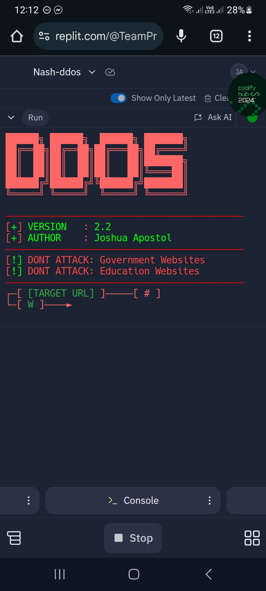
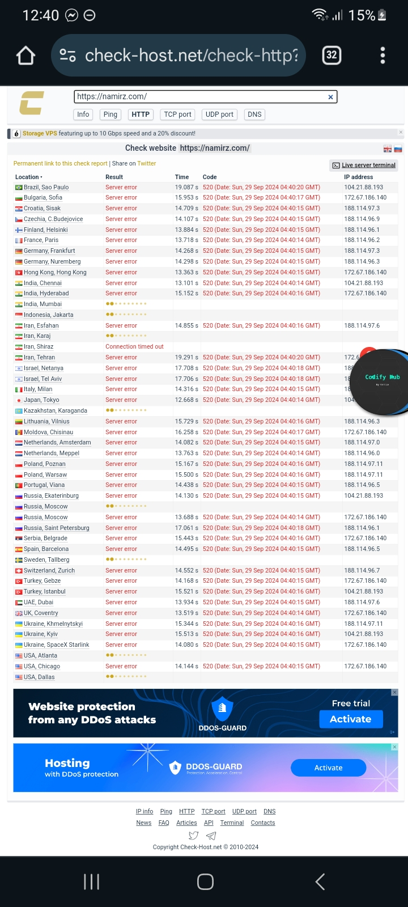

> ⚠️ **DISCLAIMER:** This tool is intended for educational and stress-testing purposes **only**. **Do not** use it against government or educational websites. Misuse may be illegal and subject to severe consequences.

---

## 📱 Supported Platforms

* Termux ✅
* Replit ✅
* Cloud Shell ✅

---

## 🔥 One-Line Automatic Setup for Termux

Copy and paste this single command into **Termux** installation:

```bash
pkg update -y && pkg install -y nodejs git && git clone https://github.com/DarkByteMods/G-DOS && cd G-DOS && npm install axios socks-proxy-agent https-proxy-agent readline && node index.js
```

> This line will:
>
> * Update your packages
> * Install Node.js and Git
> * Clone the repo
> * Install required NPM packages
> * Start the tool

---

## 🧰 Manual Installation (Step-by-Step)

If you're not using Termux or prefer a manual setup:

### 1. Install Node.js and Git

* **Termux:**

```bash
pkg update -y
pkg install -y nodejs git
```

* **Replit:** Use the Shell tab and skip Node.js install (already available).

### 2. Clone the Repository

```bash
git clone https://github.com/DarkByteMods/G-DOS
cd G-DOS
```

### 3. Install Dependencies

```bash
npm install axios socks-proxy-agent https-proxy-agent readline
```

### 4. Run the Tool

```bash
node index.js
```

---

## 📸 Proof of Tool Working


<br>


---

## ⚠️ Warnings

* ❌ Do **not** attack:

  * Government (.gov) websites
  * Educational (.edu) websites
* ✅ Only target your own servers or ones you **have permission** to test.

---

